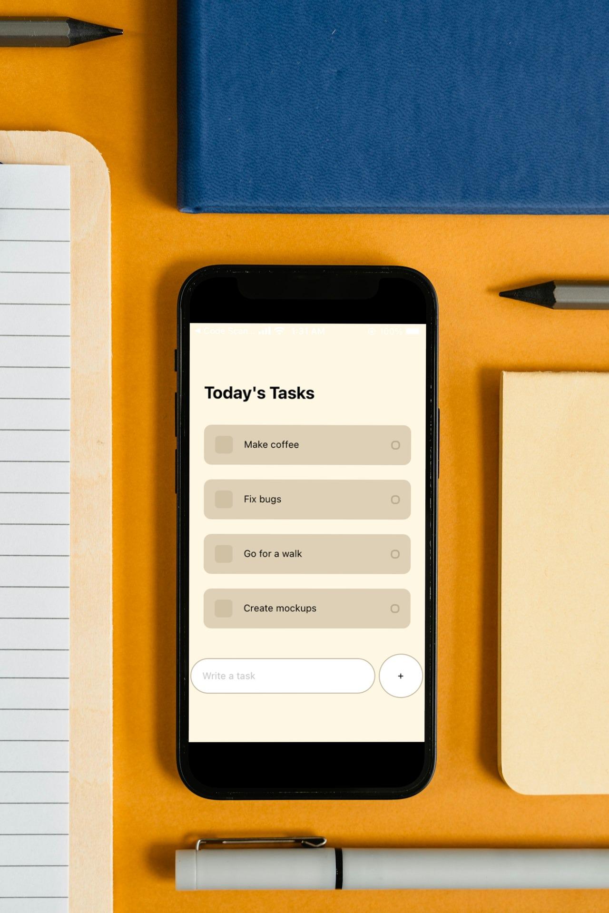
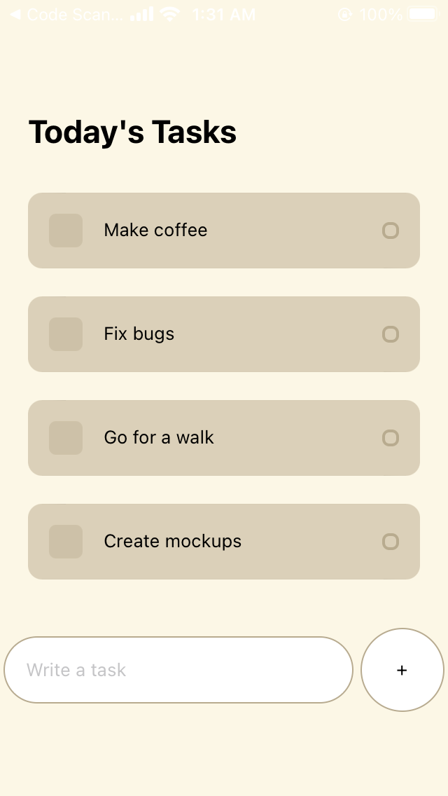

# Get It Done 📝📲



## Overview

**Get It Done** is a cross-platform TodoList app built using React Native and Expo. It provides a streamlined solution for efficient task management, combining a simple, user-friendly interface to help you stay organized and boost productivity.

## Features

- **Intuitive Interface:** A beautifully designed app with an easy-to-navigate interface.
- **Manage Tasks:** Manage tasks to stay on top of your schedule.
- **Simple UI:** Simple user-friendly interface to help you stay organized.
- **Offline Support:** Access and modify tasks without an internet connection for uninterrupted productivity.

## Tech Stack

- **React Native:** A powerful framework for building cross-platform mobile applications.
- **Expo:** Accelerate development with Expo, simplifying the deployment and testing process.
- **AsyncStorage:** Utilizes AsyncStorage for seamless task persistence, ensuring your tasks are always saved.

## Installation

1. Clone the repository:

    ```bash
    git clone https://github.com/duskdev17/todoList.git
    cd todoList
    ```

2. Install dependencies:

    ```bash
    npx install
    ```

3. Run the app:

    ```bash
    npx expo start
    ```

## Screenshots


<!-- Add more screenshots as needed -->

## Usage

1. Add a new task by tapping the "+" button.
2. View and manage your tasks in the main list.
3. Mark tasks as completed by tapping on them.
4. Edit or delete tasks as needed.

## Contribution

Contributions are welcome! Feel free to open issues and pull requests.

## Future Enhancements

- **User Authentication:** Personalize your task lists by adding user authentication.
- **Data Backup and Sync:** Implement data backup and synchronization across devices.
- **Customizable Themes:** Allow users to customize the app's theme for a personalized touch.

## Acknowledgments

Special thanks to the React Native and Expo communities for their support and inspiration.

## License

This project is licensed under the MIT License.
